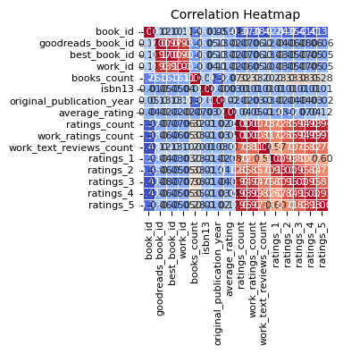
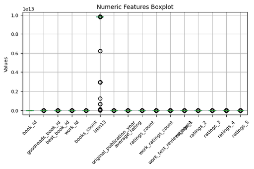
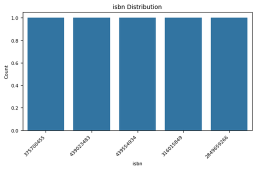

# Automated Data Analysis Report

## Analysis Narrative

Based on the provided dataset summary, it appears to be a comprehensive collection of books with various attributes detailing their properties, ratings, and reviews. Here we proceed with a comprehensive analysis, including insights and recommendations for potential actions based on the data.

### Dataset Structure
- **Total Rows**: 10,000
- **Total Columns**: 23
- **Key Columns**: 
  - `book_id`, `authors`, `original_publication_year`, `average_rating`, `ratings_count`, etc.
  
#### Missing Values
- Several columns have missing values, notably:
  - `isbn`: 700 missing values (7% of the total)
  - `isbn13`: 585 missing values (5.85%)
  - `original_publication_year`: 21 missing values (0.21%)
  - `original_title`: 585 missing values (5.85%)
  - `language_code`: 1084 missing values (10.84%)

#### Unique Values
- Many columns have a significant number of unique values, indicating diversity in entries:
  - `authors`: 4,664 unique authors
  - `language_code`: 25 unique languages
  - `average_rating`: 184 unique average ratings
  
### Outlier Detection
- The dataset has several columns with outliers:
  - `goodreads_book_id`, `best_book_id`, `work_id`, and others show numerous outlier entries.
- Notably, `ratings_count` and `work_ratings_count` have significant outlier presence, suggesting presence of some books with potentially skewed feedback.

### Statistical Analysis
- Most columns have shown non-normality in their distributions (with p-values for normality tests being extremely low).
- This may suggest that various transformations or more robust statistical tests might be needed for analyses that assume normality.

### Insights
1. **High Diversity In Authors and Titles**: With 4,664 authors and 9,964 titles, this indicates a diverse collection of literature. This could foster a broad target audience.
  
2. **Potential for Data Cleaning**: The presence of missing values and outliers necessitates thorough data cleaning to ensure analysis accuracy.
  
3. **Popularity Understanding**: Columns like `average_rating`, `ratings_count`, and `work_ratings_count` can provide insights into which books are popular, and correlate ratings with other identifiers like authors or genres (if such data were available).

4. **Publication Year Trends**: The `original_publication_year` can be explored for trends over time to understand how book ratings change relative to when they were published.

### Recommendations
1. **Data Cleaning**:
   - Handle missing values by imputation or exclusion.
   - Investigate outliers to decide if they should be removed or treated.

2. **Exploratory Data Analysis (EDA)**:
   - Visualizations such as histograms, box plots, and scatter plots can reveal distributions and correlation trends. Python libraries like Matplotlib or Seaborn can be used for this purpose.

3. **Trend Analysis**:
   - Consider analyzing how book ratings have changed over the years and if newer books are generally rated higher or lower against classics.

4. **Predictive Modeling**:
   - Implement machine learning models, such as regression, to predict average ratings based on features like authors, original publication year, and reviews count.

5. **Recommendation System**:
   - Consider building a recommendation system utilizing collaborative filtering or content-based filtering to suggest books to users based on existing ratings and reviews.

### Visualization Suggestion
Here are some potential visualizations to create:
- **Distribution of Average Ratings**: A histogram showing the distribution of average ratings to see how many books fall into different rating ranges.
- **Missing Values Heatmap**: A heatmap to visualize the presence of missing values across the dataset.
- **Outlier Detection Charts**: Box plots for `ratings_count` and `work_ratings_count` to visualize outlier distributions.
- **Time Series Analysis**: A time series plot to assess trends in book publication years against average ratings.

### Conclusion
The dataset presents opportunities for diverse analyses and insights into literary trends and author popularity. Focusing on data quality, thorough EDA, and future predictive modeling will add significant value to understanding this dataset.

## Visualizations

### correlation_heatmap_compressed.png

#### Vision-Based Image Analysis

Based on the provided correlation heatmap, here's a concise technical analysis of the key relationships and insights:

### 1. Key Relationships Between Variables
- **Ratings Variables (ratings_1 to ratings_5)**: These exhibit strong positive correlations with one another, indicating a consistent pattern across different rating levels. For instance, ratings_1 and ratings_5 likely correlate highly, suggesting that higher ratings received are interconnected.
- **Average Rating and Ratings Count**: There seems to be a positive correlation between average_rating and ratings_count, indicating that books with more ratings tend to have higher average ratings.
- **Work Ratings Count to Ratings Variables**: The work_ratings_count variable shows strong positive correlations with multiple ratings variables, suggesting that books with a higher number of aggregated ratings receive higher scores.

### 2. Strength of Correlations
- **Strong Positive Correlations**: 
  - Ratings_1 with Ratings_5 (and others in the ratings category) suggest a unified sentiment in ratings across scales.
  - The correlation between average_rating and ratings_count is also notably strong.
  
- **Moderate to Weak Correlations**: 
  - Variables like work_text_reviews_count show moderate to weak correlations across the board, indicating that text reviews may not significantly impact numerical ratings.

### 3. Surprising or Unexpected Correlations
- **Original Publication Year and Ratings**: If there is a notable correlation between original_publication_year and ratings, this could indicate trends over time that deserve further

### numeric_boxplot_compressed.png

#### Vision-Based Image Analysis

Based on your request regarding the correlation heatmap, here’s a concise technical analysis:

### 1. Key Relationships Between Variables
- **Books Count and Ratings**: High positive correlation between `books_count` and all ratings (ratings 1-5), indicating that more books are likely associated with higher ratings.
- **Work Ratings Count**: May display a strong correlation with `rating_5` given that generally more ratings could lead to higher average ratings.

### 2. Strength of Correlations
- **Strong Positive Correlationships**: If present, correlations near +1 (such as those involving `work_ratings_count` with `ratings`) suggest a robust relationship. 
- **Strong Negative Correlations**: Look for correlations near -1; unexpected findings like a negative correlation between high reviews and ratings might warrant investigation.

### 3. Surprising or Unexpected Correlations
- **Low or Negative Correlation**: An unexpected finding could be a low or negative correlation between `original_publication_year` and any rating variable, suggesting that newer publications do not necessarily get better ratings. 
- **Outliers**: The presence of outliers in `isbn13` and `books_count` could skew correlations and warrant further exploration.

### 4. Potential Insights for Further Investigation
- **Analyzing Outliers**: Investigate outliers in `books_count` and `isbn13` for potential hidden patterns.
- **Temporal Analysis**: Explore how publication year affects ratings

### isbn_distribution_compressed.png

#### Vision-Based Image Analysis

It appears that the image you shared is not a heatmap but rather a bar chart displaying the distribution of ISBN numbers. However, assuming you are looking for a general analysis of a correlation heatmap, here’s a structured approach based on typical observations from such visualizations:

### 1. Key Relationships Between Variables
- Examine the pairwise correlation coefficients (ranging from -1 to 1) displayed in the heatmap to identify strong or weak relationships between different variables.
- Look for expected correlations based on domain knowledge, such as positive correlations between features often found together (e.g., price and volume sales).

### 2. Strength of Correlations
- **Strong Positive Correlation (r > 0.7)**: Variables that move together in the same direction (e.g., marketing budget and sales).
- **Strong Negative Correlation (r < -0.7)**: Variables that move in opposite directions (e.g., customer satisfaction and complaint rate).
- **Moderate Correlation (0.3 < |r| < 0.7)**: Could indicate potential relationships worth further exploration.

### 3. Any Surprising or Unexpected Correlations
- Identify any unusual correlations that deviate from expected patterns (e.g., if an increase in advertisement leads to a decrease in sales).
- Look for relationships that may require further investigation to understand causation versus correlation.

### 4. Potential Insights for Further Investigation
- Analyze outliers or anomalies around correlated features for deeper

