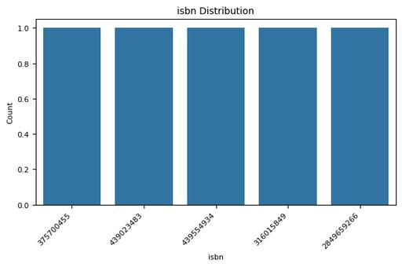

# Automated Data Analysis Report

## Analysis Narrative

### Dataset Overview

The dataset under analysis comprises a total of **10,000 rows** and **23 columns**, primarily focusing on various attributes of books from a Goodreads-like platform. The attributes include identifiers for the books, their authors, publication information, language codes, averaged ratings, and counts for different ratings and reviews. Each book is represented distinctly through `book_id`, which serves as a unique identifier.

### Key Characteristics

- **Data Completeness**: The dataset is relatively complete, with the `isbn`, `isbn13`, `original_publication_year`, `original_title`, and `language_code` fields exhibiting missing values. Specifically, the **isbn** and **isbn13** fields have missing percentages of **7.0%** and **5.85%**, respectively.

- **Unique Values**: There are **10,000 unique values** across identifiers (`book_id`, `goodreads_book_id`, `best_book_id`, `work_id`). In contrast, attributes like `authors` show a lesser count of **4,664 unique authors**, indicating a diverse collection but also suggesting some authors contribute multiple titles.

- **Publication Year Insights**: The `original_publication_year` spans **293 unique years**, with a notable **0.21%** of the dataset lacking this information. This reveals a historical spread of books available in the dataset.

- **Rating Distribution**: The dataset presents **184 unique average ratings** with **ratings count** entries varying significantly. The most rated category (1-5 stars) indicates a preference for 4 and 5-star ratings, with **8,103** books rated at 5 stars compared to **2,630** at 1 star.

- **Outlier Presence**: Multiple columns exhibit outliers, with **books_count**, `isbn13`, and `original_publication_year` being particularly affected. The presence of **async outliers** in **ratings** and **ratings counts** may skew interpretations relating to popular books and their reception.

### Insights and Recommendations

1. **Diversity of Literature**: There is an opportunity to explore literature spanning various periods due to the extensive range of publication years. This can guide marketing strategies for different audience segments (e.g., periodic themed collections).

2. **Focus on High Rating Books**: With a substantial preference for highly rated books, marketers could highlight "top-rated" titles to attract readers. These could include curating lists based on user preferences or trending high-rated books.

3. **Identify Underrepresented Authors**: Authors with fewer titles in the dataset could be showcased to diversify recommendations for readers and enrich the content offered on the platform.

4. **Investigate Missing ISBN Data**: The missing values in the ISBNs are significant for categorizing and linking books properly in international databases and marketplaces. Efforts should be taken to fill these gaps.

5. **Outlier Treatment**: The dataset's outliers may be influencing trend analyses negatively. Proper statistical methods should be employed to deal with these outliers to attain a more accurate representation of book performances.

### Limitations for Further Investigation

1. **Statistical Normality**: Many columns failed the normality test, suggesting non-normal distributions that could complicate standard statistical analyses, affecting inferential statistics. Non-parametric methods may need to be explored for analyses.

2. **Missing Data Implications**: Columns with missing values (such as `original_title` and `language_code`) could potentially skew insights, making it essential to consider methods for imputation or exclusion based on the context of analysis.

3. **Homogeneity in User Rating**: Despite the broad spread of ratings, a closer examination into the demographic or psychographic data of the users providing these ratings is lacking. Understanding user biases could provide deeper insights into the dataset.

4. **Temporal Dynamics**: The dataset lacks temporal analysis aspects; thus, understanding how book ratings and reviews evolve over time is limited and would require additional data points on reviews or ratings timestamping.

### Conclusion

This analysis of the dataset presents insightful characteristics regarding books, their ratings, and the authors within the collection. It reflects the importance of proper handling of missing data and outliers to enhance data integrity. Additionally, the recommendations put forth can assist in leveraging this dataset for marketing strategies while addressing limitations that may require focused investigations going forward.

## Visualizations

### correlation_heatmap_compressed.jpg

### numeric_boxplot_compressed.jpg

### isbn_distribution_compressed.jpg

