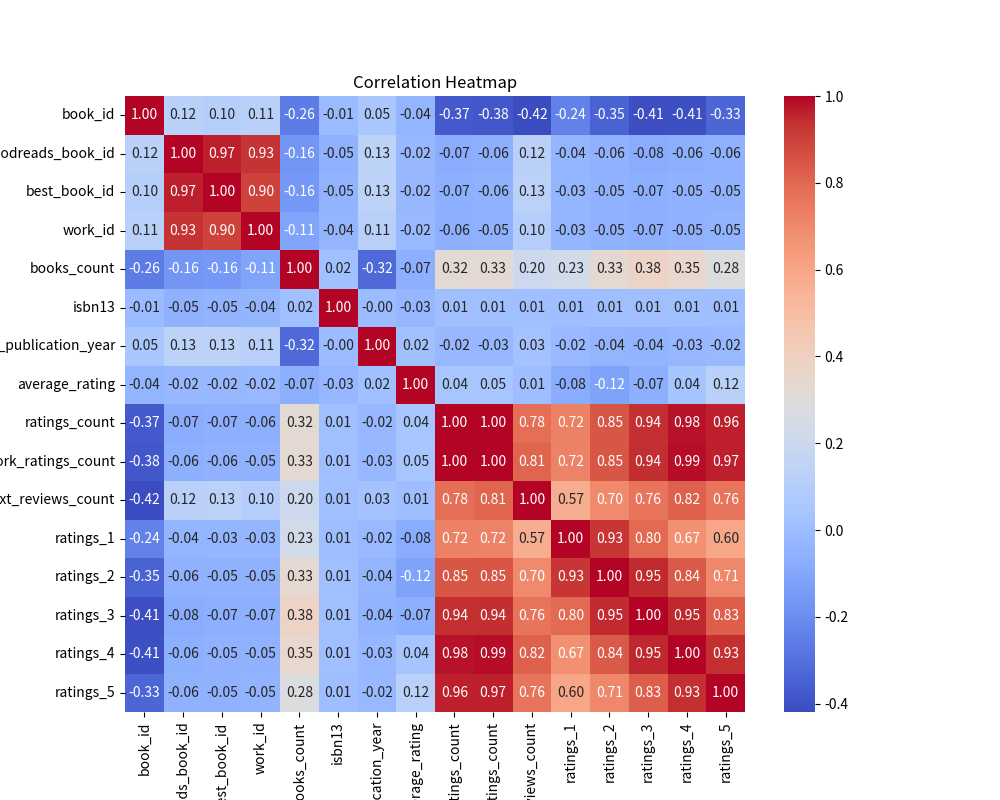
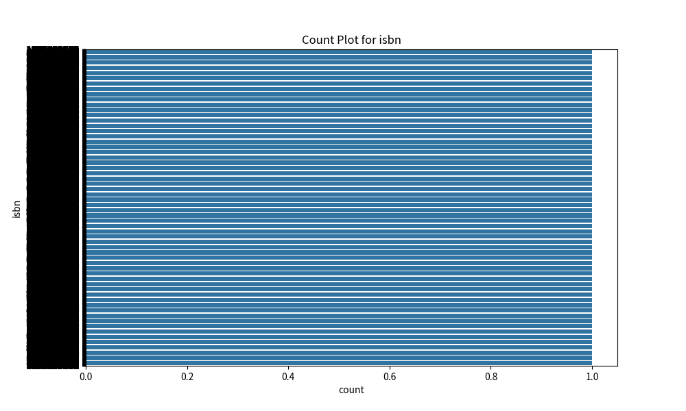
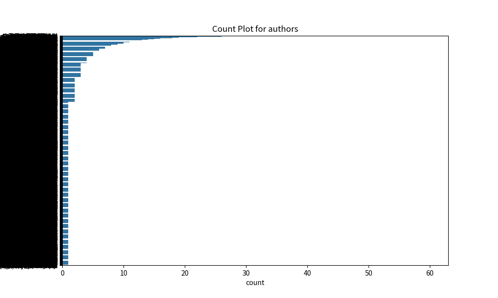

# Automated Analysis

### Summary

### Narrative Summary and Key Insights from the Dataset

The dataset under analysis consists of 10,000 rows and 23 columns, providing a detailed snapshot of a collection of books. Each row represents an individual book and contains various attributes, including unique identifiers, bibliographic information, author details, publication years, language codes, and ratings data.

#### Data Overview

1. **Identifiers and Basic Information**:
   - **Identifiers**: The dataset contains several unique identifiers such as `book_id`, `goodreads_book_id`, and `work_id`, which allow for easy referencing and cross-comparison with other databases or tables.
   - **Book Details**: Key fields like `title`, `authors`, and `original_title` provide essential bibliographic information that could be valuable for cataloging and searching.

2. **Publication and Language**:
   - **Publication Year**: Most books have a recorded `original_publication_year`, though there are 21 missing entries. This gap could indicate self-published or less traceable works, potentially biasing the average age of books in this dataset.
   - **Language Code**: There are 1,084 missing values in the `language_code`, suggesting many entries may lack critical information on the language, which is essential for regional categorization and audience targeting.

3. **ISBN Information**:
   - **ISBNs**: A notable number of entries are missing `isbn` (700 missing values) and `isbn13` (585 missing values). The absence of these international book identifiers can impair cataloging and sales tracking efforts as ISBNs are vital for distribution and sales.

4. **Ratings and Reviews**:
   - **Average Rating**: The `average_rating` field contains no missing values but understanding distribution is essential for insights on book quality. Exploring the ratings count (`ratings_count`, `work_ratings_count`) and detailed breakdowns of ratings (from 1 to 5 stars) will help visualize user engagement and satisfaction.
   - **Review Counts**: The counts of text reviews (`work_text_reviews_count`) are all present, providing insight into reader interaction and validation of ratings through qualitative feedback.

5. **Visual Media**:
   - Both `image_url` and `small_image_url` are well populated, meaning that visual representations of the books are readily available, which can enhance user experience on platforms displaying this data.

#### Key Insights

- **Data Completeness**: While most fields are complete, there are significant gaps, particularly in ISBNs and language codes. Addressing these missing values may enhance the robustness of the dataset, especially for operations involving data merging or analytics.
  
- **Rating Distribution Analysis**: Given that no entries are missing average ratings or overall ratings counts, a focused analysis on the distribution of ratings (how many books fall under each star category) could reveal trends in reader preferences. Plotting this data could uncover insights such as whether the majority of books trend towards higher ratings.

- **Potential Analysis Directions**:
  - **Correlation Analysis**: Investigate any potential correlations between `average_rating` and `ratings_count`. This could establish whether popular books (high ratings count) tend to receive better ratings.
  - **Publication Trends**: Analyzing `original_publication_year` along with `average_rating` might reveal whether older books tend to receive more favorable ratings compared to newer publications, highlighting possible shifts in reader preferences.
  - **Language and Engagement**: Exploring how language codes correlate with average ratings and review counts could provide insights into market segmentation and regional preferences for genres.

- **User Experience and Marketing**: The availability of imagery indicates readiness for enhanced user engagement through visual media. Platforms utilizing this dataset could efficiently market books using visually appealing thumbnails or cover images, potentially increasing user interest.

### Conclusion

This dataset offers a rich tableau for exploring book characteristics, reader behaviors, and trends in the publishing industry. Addressing the gaps in ISBN and language information will be critical for fostering a comprehensive understanding of the collection and maximizing its utility for various analytical needs.

