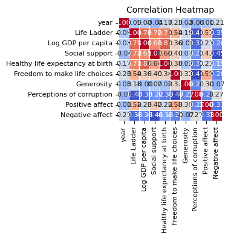

# Automated Data Analysis Report

## Analysis Narrative

### Comprehensive Narrative on the Dataset

#### 1. Brief Overview of the Dataset
The dataset consists of 2,363 rows and 11 columns, analyzing various factors that contribute to a country’s perceived well-being and happiness. It includes data from 165 unique countries across 19 years. The primary measures involve subjective ratings such as the "Life Ladder", which represents happiness, and various socio-economic indicators like GDP per capita, social support, healthy life expectancy, and perceptions of corruption. 

Each column contains various types of data, including both continuous and categorical variables. The dataset's diverse measures provide a multifaceted view of wellbeing, emphasizing not just economic indicators but also social and subjective measures of happiness.

#### 2. Key Characteristics and Interesting Patterns
The dataset presents several intriguing features:

- **Missing Values**: There are various degrees of missingness across columns, notably for "Generosity", "Healthy life expectancy at birth", and "Perceptions of corruption". This raises questions about the completeness and potential biases in these measures. 

- **Outliers**: There are notable outliers in several measures, particularly "Social support" (48 outliers) and "Perceptions of corruption" (194 outliers). The presence of outliers suggests that some countries exhibit extreme values, which could skew average measures and indicate significant variability in experiences.

- **Non-Normal Distributions**: All key measures failed normality tests, indicating that they are not normally distributed. This could affect the results of statistical analyses and necessitate the use of non-parametric methods for further analysis.

- **Diversity of Values**: The unique value counts show significant diversity in responses, especially in subjective measures like "Life Ladder" (1,814 unique values) and "Social support" (484 unique values). This suggests a wide range of experiences and perceptions across different populations.

#### 3. Potential Insights and Recommendations
An analysis of this dataset can lead to several insights and actionable recommendations:

- **Socio-economic Correlation**: A deeper statistical analysis such as regression or correlation studies could uncover strong relationships between socio-economic indicators (like GDP) and subjective measures (like happiness). This could help countries focus on areas needing improvement.

- **Focus on Outliers**: Investigating countries with outliers in happiness and corruption perception could lead to understanding unique local factors that either enhance or detract from citizen wellbeing. Case studies of these countries might reveal best practices or pitfalls.

- **Address Missing Values**: If conducting further analyses, it's crucial to handle missing values appropriately to avoid bias, possibly through imputation techniques or exclusion based on the analysis context.

- **Policy Relevance**: Policymakers could leverage insights from this dataset to design interventions that improve citizens' happiness levels, focusing on social support systems and reducing perceptions of corruption, which could enhance trust in institutions.

#### 4. Limitations or Areas Requiring Further Investigation
This dataset is robust, but several limitations and areas for future investigation should be noted:

- **Bias in Self-Reported Data**: Measures like "Life Ladder" are reliant on self-reported data which can introduce bias based on cultural contexts and personal circumstances. Further qualitative studies could complement these quantitative measures.

- **Temporal Aspect of Data**: Given the data spans multiple years, potential changes in measures over time are not accounted for. Time-series analyses may provide additional insights into trends and shifts in wellbeing.

- **Causal Relationships**: While correlations may be drawn between variables, establishing causation is challenging without experimental or longitudinal data. More rigorous methodologies might be required to ascertain these relationships.

- **Missingness Patterns**: Investigating the patterns of missingness further might reveal insights regarding data collection processes or the socio-economic status of specific countries, enhancing understanding of the constraints affecting the data.

In conclusion, this dataset presents a valuable opportunity to explore determinants of happiness and wellbeing across various countries. Addressing the limitations and utilizing the insights effectively can guide both researchers and policymakers in fostering better living conditions globally.

## Visualizations

### correlation_heatmap.png

### numeric_boxplot.png

### Country name_distribution.png

