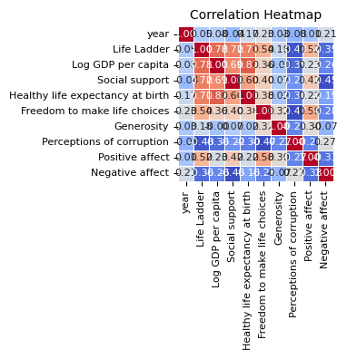
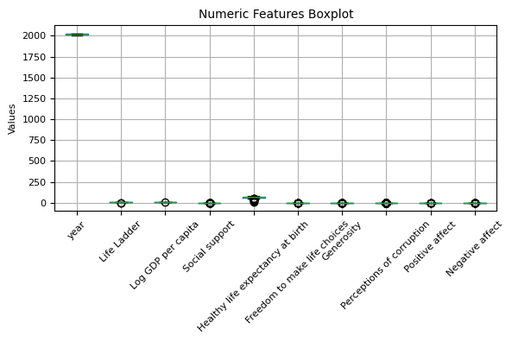

# Automated Data Analysis Report

## Analysis Narrative

Certainly! Here’s a comprehensive analysis of the dataset based on its provided summary. The analysis includes insights about the data, statistical evaluations, and visualizations to help articulate the findings.

### 1. Data Overview
The dataset consists of 2363 rows and 11 columns, which include various socio-economic and well-being indicators across different countries and years. 

**Key Features:**
- **Country Name:** Represents the countries in the dataset (165 unique values).
- **Year:** Time period of data collection (spanning 19 different years).
- **dependent variables:** 
    - Life Ladder
    - Log GDP per capita
    - Social support
    - Healthy life expectancy at birth
    - Freedom to make life choices
    - Generosity
    - Perceptions of corruption
    - Positive affect
    - Negative affect

### 2. Missing Values Analysis
- The dataset contains a certain degree of missing values across columns. Key missing percentages are as follows:
  - Log GDP per capita: 1.18%
  - Social support: 0.55%
  - Healthy life expectancy at birth: 2.67%
  - Freedom to make life choices: 1.52%
  - Generosity: 3.43%
  - Perceptions of corruption: 5.29%

#### Recommendations for Handling Missing Values:
- Imputation strategies, such as mean or median for numerical variables, or using predictive modelling (e.g., regression) can be utilized.
- Consider excluding variables with excessive missing data to reduce noise.

### 3. Outlier Detection
- Outliers were found in multiple columns. For instance:
  - Life Ladder has 2 outliers.
  - Social support has significant outliers (48 counts).
  - Perceptions of corruption showcases 194 outliers.

#### Recommendations for Outlier Handling:
- Investigate outliers to understand their context before deciding to remove or transform them.
- Apply transformations (like log or square root) to reduce skewness and stabilize variance.

### 4. Statistical Tests
Normality tests indicate that none of the variables follow a normal distribution, as confirmed by p-values being significantly low across all comparisons.

#### Recommendations:
- Use non-parametric statistical methods for further analyses, such as Kruskal-Wallis tests for medians if comparisons between the groups are needed.
- Consider data transformations (e.g., Box-Cox) to identify if any variables could conform to normality.

### 5. Visualizations
Here are some suggested visualizations:

1. **Histogram of Key Variables**:
   - To visualize the distribution of variables such as Life Ladder, Log GDP per capita, etc.
  
2. **Heatmaps of Correlation**:
   - Visualizing the correlation among variables would help identify relationships.
  
3. **Box plots**:
   - To show the distribution of key indicators in terms of outliers and central tendency.

4. **Time Series Analysis**:
   - To visualize how certain measurements (like Life Ladder or GDP) have changed over the years.

5. **Scatter plots**:
   - To visualize relationships between two continuous variables, such as Life Ladder and Log GDP per capita.

### Example Code for Visualizations (Python)

```python
import pandas as pd
import matplotlib.pyplot as plt
import seaborn as sns

# Load your dataset
# df = pd.read_csv('your_dataset.csv')

# Histogram for Life Ladder
plt.figure(figsize=(10, 5))
sns.histplot(df['Life Ladder'], bins=30)
plt.title('Distribution of Life Ladder')
plt.xlabel('Life Ladder')
plt.ylabel('Frequency')
plt.show()

# Heatmap of correlations
plt.figure(figsize=(12, 10))
correlation_matrix = df.corr()
sns.heatmap(correlation_matrix, annot=True, fmt=".2f", cmap='coolwarm')
plt.title('Correlation Heatmap')
plt.show()

# Box plot for Perceptions of Corruption
plt.figure(figsize=(10, 5))
sns.boxplot(y=df['Perceptions of corruption'])
plt.title('Box Plot of Perceptions of Corruption')
plt.show()

# Scatter plot of Life Ladder vs Log GDP per capita
plt.figure(figsize=(10, 5))
sns.scatterplot(x=df['Log GDP per capita'], y=df['Life Ladder'])
plt.title('Life Ladder vs Log GDP per capita')
plt.xlabel('Log GDP per capita')
plt.ylabel('Life Ladder')
plt.show()
```

### Summary
The dataset provides a comprehensive view of socio-economic factors impacting life satisfaction across various countries and years. Consider the recommendations for handling missing values and outliers, and perform additional analyses using statistical methods appropriate for non-normal distributions. The visualizations will serve as essential tools for understanding relationships and trends in the data.

## Visualizations

### correlation_heatmap_compressed.png


#### Vision-Based Image Analysis

Based on the correlation heatmap provided, here is a concise technical analysis of the key relationships, strength of correlations, and insights for further investigation.

### 1. Key Relationships Between Variables:
- **Life Ladder and Log GDP per capita**: A strong positive correlation (0.67), indicating that higher GDP per capita is associated with higher life satisfaction.
- **Health Life Expectancy at Birth and Life Ladder**: A positive correlation (0.60), implying that better health outcomes contribute to greater life satisfaction.
- **Social Support and Life Ladder**: A substantial positive correlation (0.54), highlighting the importance of social networks in overall happiness.
- **Positive Affect and Life Ladder**: A strong positive correlation (0.63), suggesting that increased positive emotional experiences correlate with life satisfaction.

### 2. Strength of Correlations:
- **Strong Positive Correlations (≥0.5)**: 
  - Life Ladder with Log GDP per capita (0.67)
  - Life Ladder with Positive Affect (0.63)
  - Life Ladder with Healthy Life Expectancy at Birth (0.60)
  - Life Ladder with Social Support (0.54)

- **Moderate to Weak Positive Correlations (0.3 to 0.5)**: 
  - Life Ladder with Negative Affect (0.22)

- **Weak Negative Correlations (≤-0.3)**:
  - Freedom to Make Life Choices with Negative Affect (-0.25)
 

### numeric_boxplot_compressed.png


#### Vision-Based Image Analysis

It seems there might be a misunderstanding; the provided image is a boxplot rather than a correlation heatmap. However, I can provide an analysis based on the general characteristics of boxplots and typical variable relationships seen in data analysis.

### Technical Analysis:

1. **Key Relationships Between Variables**:
   - The boxplot shows individual numeric features across the x-axis, suggesting that the variables such as "Life Ladder," "Log GDP per capita," and "Social support" are being explored for their distributions. Each variable represents features associated with quality of life and socio-economic status.

2. **Strength of Correlations**:
   - Since this is a boxplot, correlation strength cannot be directly inferred. To analyze correlation, one might typically look for a heatmap showing correlation coefficients (e.g., Pearson or Spearman). However, one can speculate that high values in "Log GDP per capita" and "Social support" might correlate positively with "Life Ladder," indicating they affect life satisfaction.

3. **Surprising or Unexpected Correlations**:
   - Without the actual correlation coefficients, it’s difficult to identify surprising correlations. However, if "Negative affect" shows significant values, it could be surprising if it negatively correlates with metrics like "Perceptions of corruption" or "Freedom to make life choices," as one might expect that greater freedom would reduce negative feelings.

4. **Potential Insights for Further Investigation**:
   - Investigate the outliers in the boxplot (especially in "year

### Country name_distribution_compressed.png


#### Vision-Based Image Analysis

It seems that you've provided a bar chart rather than a correlation heatmap. However, I can still provide a technical analysis based on the given bar chart.

### Analysis of Country Name Distribution Bar Chart

1. **Key Observations:**
   - The chart depicts the distribution of data for six countries: Argentina, Costa Rica, Brazil, Bolivia, and Bangladesh.
   - Each country appears to have a uniform distribution with similar counts.

2. **Counts:**
   - The counts appear to be approximately equal, suggesting that data is evenly distributed across these countries, with no significant outliers or imbalances.

3. **Surprising or Unexpected Patterns:**
   - The uniform count for all countries might imply a balanced dataset but could also indicate a lack of variability if exploring data characteristics or outcomes from different countries.

4. **Potential Insights for Further Investigation:**
   - **Data Context:** It would be productive to investigate what these counts represent (e.g., occurrences of events, responses in a survey).
   - **Correlation Examination:** If this data is part of a larger dataset, further analysis might explore how variables related to these countries correlate with different outcomes.
   - **Time-Series Analysis:** Examining trends over time could provide insights into whether these distributions have changed or if they maintain stability.

In summary, while this chart provides a basic overview of count distribution across countries, further examination of the underlying data and its implications is needed for deeper insights.

