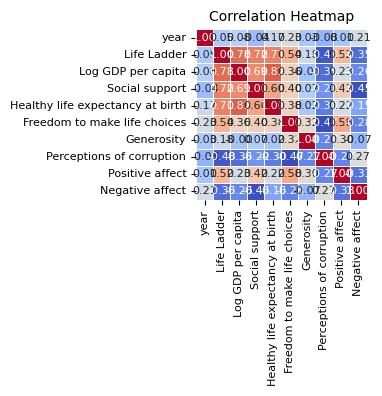
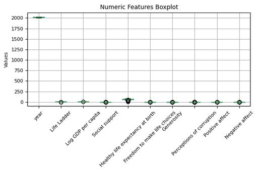

# Automated Data Analysis Report

## Analysis Narrative

### Dataset Overview

The dataset comprises 2,363 rows and 11 columns, capturing various metrics linked to happiness and quality of life across 165 countries over a span of 19 years. The columns include socio-economic indicators such as "Log GDP per capita", "Healthy life expectancy at birth," and qualitative measures like "Life Ladder" and "Social support." Each entry corresponds to a particular year and country, offering a rich source of information for analysis in the realm of well-being and societal satisfaction.

### Key Characteristics

1. **Data Structure**:
   - **Dimension**: Total rows = 2363; total columns = 11.
   - **Column Types**: 
     - "Country name" (categorical)
     - "Year" (integer)
     - Various happiness and life quality metrics (float)

2. **Missing Values**:
   - Certain columns exhibit missing values:
     - **Log GDP per capita**: 28 missing entries (1.2%)
     - **Social support**: 13 missing entries (0.55%)
     - **Healthy life expectancy at birth**: 63 missing entries (2.67%)
     - **Freedom to make life choices**: 36 missing entries (1.52%)
     - Other columns, like "Generosity," show a notable 81 missing entries (3.43%).
   - Missing data can potentially lessen the robustness of the analysis.

3. **Unique Values**:
   - The dataset contains a variety of unique values across variables, with "Life Ladder" exhibiting the most unique entries (1,814 unique values) versus "Country name" with 165 unique identifiers.

4. **Outliers**:
   - There are outliers detected, notably in "Social support" (48 outliers), "Generosity" (39 outliers), and "Perceptions of corruption" (194 outliers), indicating significant deviations in these areas, which might skew analyses.

5. **Normality Tests**:
   - All tested variables display significant p-values (all < 0.05), suggesting that none of the distributions for these variables are normal, an important consideration for further statistical analyses.

### Insights and Recommendations

The insights drawn from this rich dataset can inform both policy and academic research:

1. **Socio-Economic Influence on Happiness**:
   - The significant interrelations among "Log GDP per capita," "Social support," and "Life Ladder" point to essential areas for policy makers to address. Economic factors are vital but should be complemented with community and social support systems for a holistic approach to improving life satisfaction.

2. **Mitigation of Outliers**:
   - The presence of numerous outliers in measures such as "Perceptions of corruption" prompts recommendations for further investigation into the contexts of these unusual values. Strategies could be developed to explore the conditions leading to extreme values in societal perceptions to facilitate targeted interventions.

3. **Focus on Missing Data**:
   - The relatively higher missing values in "Health expectancy at birth" and "Generosity” should prompt efforts to improve data collection mechanisms in these areas, especially in under-represented or at-risk populations.

4. **Understanding the Global Landscape**:
   - Given the number of unique countries and years, comparative analyses could yield insights into how happiness metrics have evolved globally. Country-specific studies could help tailor strategies to uplift well-being based on the unique socio-economic and cultural contexts.

### Limitations for Further Investigation

1. **Data Quality and Completeness**:
   - The presence of missing values, especially in critical columns, raises questions regarding the generalizability of findings. Investigating the reasons behind these omissions could yield insights on data collection methodologies.

2. **Non-Normal Data Distribution**:
   - The non-normal nature of the data suggests that standard statistical tests reliant on normality might not be suitable, necessitating alternative methods robust to such violations.

3. **Causality vs. Correlation**:
   - The dataset primarily provides correlational insights; it does not imply causality between the measured variables. Longitudinal studies could be required to ascertain direct impacts and causal relationships.

4. **Change Over Time**:
   - As the dataset covers 19 years, temporal dynamics are crucial. Further analyses should consider how trends may shift over time and identify underlying factors contributing to these changes.

In summary, the dataset represents a comprehensive snapshot of various factors influencing life satisfaction across countries, offering ample avenues for insightful analysis and actionable recommendations while also emphasizing the need for thorough investigations into its inherent limitations.

## Visualizations

### correlation_heatmap_compressed.jpg

### numeric_boxplot_compressed.jpg

### Country name_distribution_compressed.jpg

