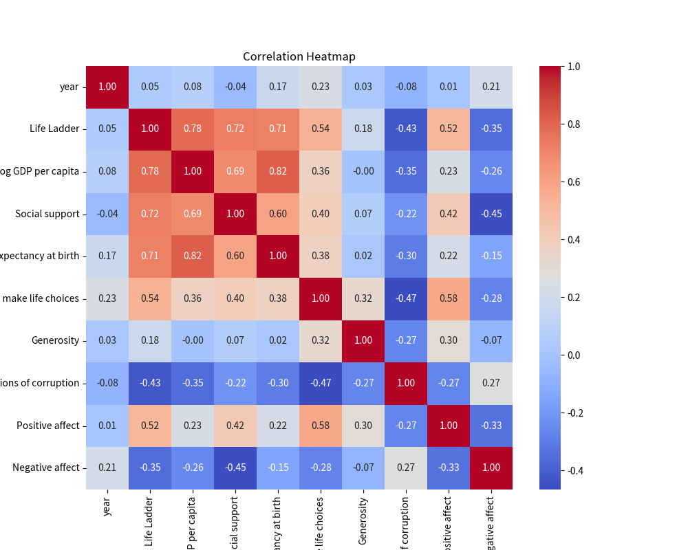

# Automated Analysis

### Summary

Certainly! This dataset encompasses insights into various factors contributing to well-being and happiness across different countries, with a total of 2,363 observations and 11 key variables. Each observation represents a unique combination of country and year, allowing for an analysis of trends over time and across geographical boundaries.

### Narrative Summary:

1. **Country-Specific Data**: The dataset includes information from multiple countries over different years, providing a broad perspective on the factors influencing life satisfaction and happiness across various cultures and economies.

2. **Key Metrics**: 
   - **Life Ladder**: This metric likely represents a subjective well-being measure, functioning as an overall happiness score.
   - **Log GDP per capita**: Economic output per person is captured through a logarithmic transformation, highlighting the relationship between national wealth and individual happiness.
   - **Social Support**: Measures the perceived support individuals can count on from friends and family, which can significantly impact overall life satisfaction.
   - **Healthy Life Expectancy**: This metric provides insights into the health dimension influencing quality of life.
   - **Freedom to Make Life Choices**: Such freedom is crucial for personal autonomy and satisfaction.
   - **Generosity**: Represents the willingness to help others, which can foster social connections and enhance happiness.
   - **Perceptions of Corruption**: This variable reflects the levels of corruption within countries, impacting trust and social stability.
   - **Positive and Negative Affects**: These dimensions provide insights into the emotional well-being of individuals, influencing their overall life satisfaction.

### Key Insights:

1. **Missing Data Analysis**: 
   - Several variables exhibit missing data points, notably:
     - **Generosity**: With 81 missing values, it raises questions about societal norms and reported altruistic behaviors.
     - **Perceptions of Corruption**: 125 missing records may indicate issues with data collection or reporting in certain regions, potentially skewing discussions around governance and trust.
   - The relatively high number of missing values in health-related and social factors suggests challenges in assessing well-being comprehensively, as healthy life expectancy and social support are foundational to overall happiness.

2. **Economic vs. Non-Economic Factors**: 
   - An analysis may indicate the interplay between economic factors (Log GDP per capita) and social dimensions (Social support and Freedom to make choices). Understanding this relationship is vital in recognizing that while wealth contributes to happiness, social structures and personal freedoms are equally critical.

3. **Health Implications**:
   - The data on Healthy Life Expectancy and its associated missing values may signal a need for better healthcare systems in some countries, suggesting that improvements in health can positively influence overall life satisfaction.
  
4. **Emotional Metrics**: 
   - The presence of both Positive and Negative affects provides a balanced view of emotional well-being. Countries with high Life Ladder scores likely correlate with high positive affect and low negative affect, suggesting a nuanced understanding of happiness that moves beyond economic indicators alone.

5. **Generosity and Corruption Dynamics**: 
   - High missing values for Generosity and Perceptions of corruption might correlate with lower happiness levels, indicating societies where individuals face systemic barriers to altruism or trust, thus affecting overall satisfaction levels.

### Conclusions:
This dataset provides a unique lens into the multifaceted nature of happiness across nations. While economic indicators serve as a backdrop, the importance of social support, health, personal freedoms, and emotional well-being cannot be overstated. Addressing the missing values, particularly in key variables, is crucial for refining analysis and deriving actionable insights that can guide policies aimed at enhancing quality of life on a global scale. Further exploration into the interactions between these dimensions can yield transformative strategies to foster well-being worldwide.

