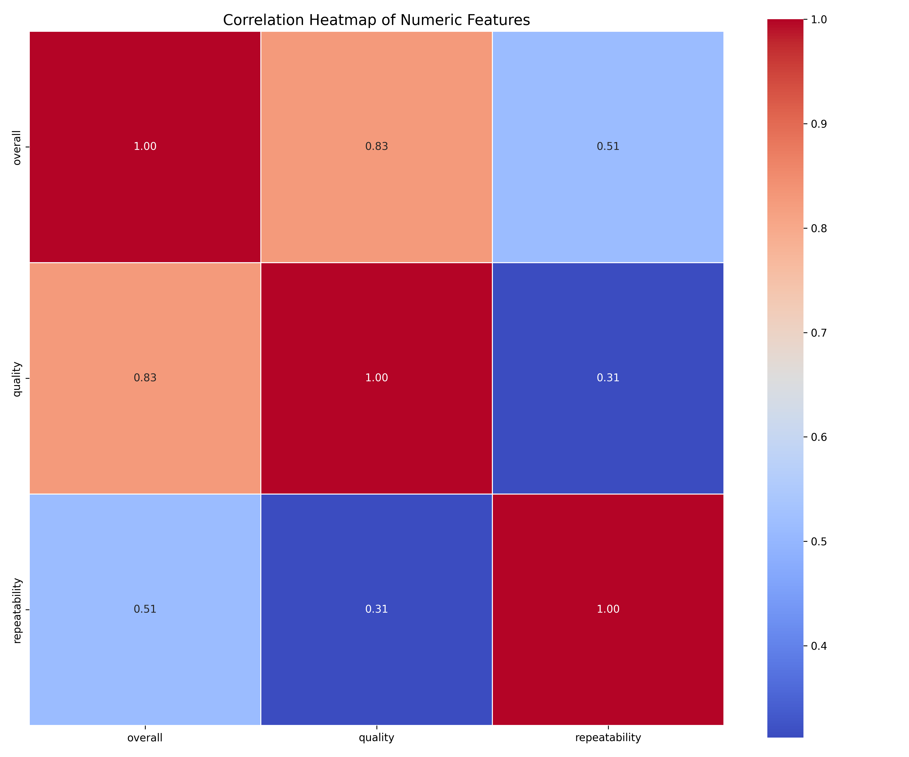
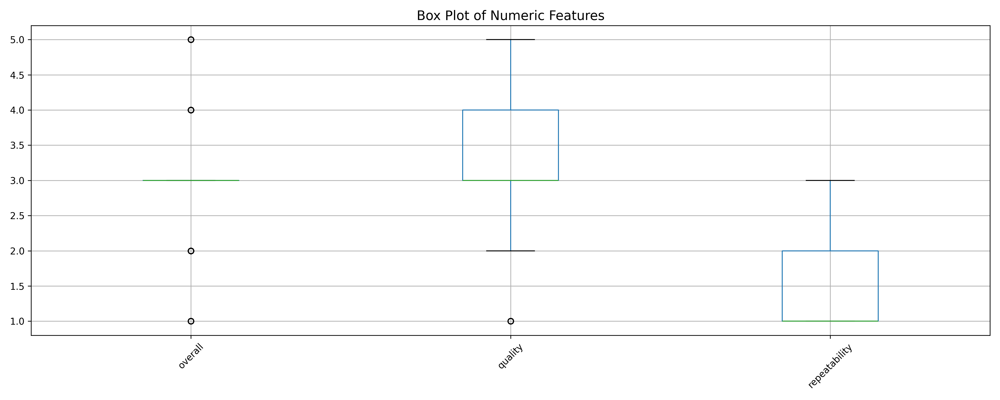
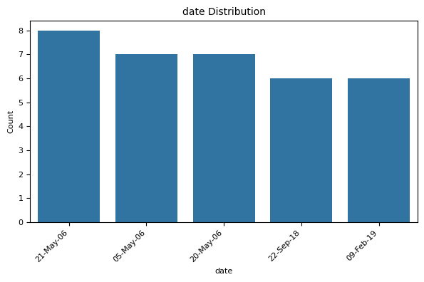

# Automated Data Analysis Report

## Analysis Narrative

### Comprehensive Narrative on the Dataset

#### 1. Brief Overview of the Dataset

The dataset consists of 2,652 observations and is structured with eight columns representing various attributes: `date`, `language`, `type`, `title`, `by`, `overall`, `quality`, and `repeatability`. The dataset captures a range of information, with most columns populated with categorical data (e.g., `language`, `type`, `title`, `by`) and numerical assessments (`overall`, `quality`, `repeatability`). There are a few missing values in `date` (99) and `by` (262), but the rest of the columns are fully populated. The `overall` ratings are assessed on a scale where the outlier analysis reveals notable insights.

#### 2. Key Characteristics and Interesting Patterns

- **Dimensions**: The dataset has 2,652 rows, 8 columns, with a variety of categorical and numerical variables.
- **Missing Values**: The missing values are relatively low overall (approximately 3.73% for `date` and almost 10% for `by`), specifically indicating some gaps in contributor data which could affect insights related to authorship.
- **Unique Value Count**: There are 2055 unique dates, 11 unique languages, 8 types, and 2312 unique titles, with an extensive diversity in the `title` column.
- **Outliers**: A significant number of outliers were detected in the `overall` ratings. Specifically, 1216 entries fall outside the established bounds, suggesting these ratings show a highly skewed distribution, further reaffirmed by the normality test results (p-value is extremely low, indicating non-normality). The `quality` ratings also exhibit non-normality with some outliers identified.
- **Language Diversity**: With 11 unique languages represented, it prompts considerations of linguistic and cultural variations affecting the observed ratings.

#### 3. Potential Insights and Recommendations

- **Outlier Investigation**: The high number of outliers in the `overall` ratings indicates a need to explore the distribution of these ratings further. It would be beneficial to dissect the underlying causes—whether these reflect true variability in quality or anomalies that should be addressed.
- **Quality Metrics**: Given that the normality tests for quality and repeatability also returned significant non-normality parameters, a detailed examination of how different types and languages affect quality and overall ratings could provide valuable insights into improving content quality.
- **Missing 'by' Column**: The missing data in the `by` column, which indicates the contributor, signifies a need for efforts to capture comprehensive contributor information. Establishing systems to ensure contributor identification could enrich insights related to authorship impacts on overall ratings.
- **Cross-Linguistic Analysis**: Given the dataset's multilingual compositions, further analysis on how language correlates with `overall`, `quality`, and `repeatability` could enhance understanding of performance across cultural contexts, providing tailored recommendations for different language speakers.

#### 4. Limitations or Areas Requiring Further Investigation

- **Date Distribution**: Understanding the distribution and importance of the dates could help contextualize trends over time and identify periods of significant activity or performance.
- **Sample Representativity**: The dataset lacks a comprehensive analysis of whether these entries are representative of the population intended to be measured. Exploration into the selection and collection process could ensure findings are generalizable.
- **Impact of Outliers**: With a substantial fraction of the dataset categorized as outliers, further investigation into these cases is critical. Are these outliers instances of exceptional performance or errors in data reporting?
- **Quality Reliability**: As quality ratings show similar non-normal distributions, validation of what constitutes ‘quality’ within this context could be investigated further and standardized across measures.

In conclusion, while the dataset sheds a significant amount of light on the observed phenomena, especially concerning outlier behaviors in ratings, areas for deeper exploration remain. There is substantial potential for practical insights that can enhance overarching trends, stifle inequalities in performance evaluation, and guide future actions in data handling and content quality assurance.

## Visualizations

### correlation_heatmap.png

### numeric_boxplot.png

### date_distribution.png

