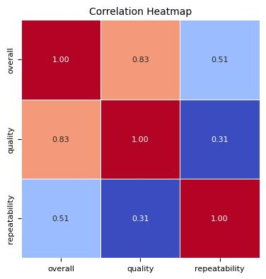
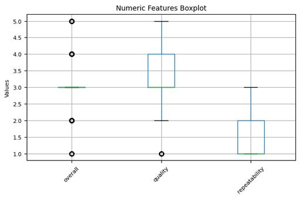
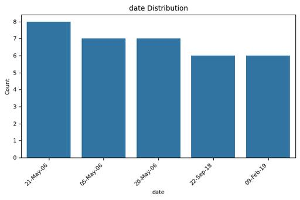

# Automated Data Analysis Report

## Analysis Narrative

### Narrative Analysis of the Dataset

#### 1. **Dataset Overview**
The dataset consists of 2,652 entries across 8 columns, providing a multifaceted view of a set of evaluations. The columns include categorical attributes such as "date," "language," "type," "title," and "by," along with numerical evaluations such as "overall," "quality," and "repeatability." The dataset, structured to collect qualitative assessments, exhibits various data characteristics that warrant closer inspection to extract meaningful insights.

#### 2. **Key Characteristics**
- **Missing Values:** There are a total of 99 missing entries for the "date" column, representing 3.73% of the dataset. Additionally, there are 262 missing entries for the "by" column (approximately 9.88%). All other columns have no missing values, indicating a relatively complete dataset for most attributes.
  
- **Unique Values:** The dataset holds 2,055 unique dates, suggesting a broad time frame. In terms of languages, there are 11 unique entries, and the "type," "title," and "by" columns have 8, 2,312, and 1,528 unique entries respectively, indicating a rich diversity in content. The numerical evaluations—overall, quality, and repeatability—exhibit lower unique counts (5 each for overall and quality, 3 for repeatability), suggesting a more standardized evaluation framework.

- **Outliers:** The overall scores show a significant count of outliers (1,216 instances) with nearly all values clustered around the lower threshold (a lower bound of 3.0). In contrast, quality evaluations have 24 outliers while repeatability has none, suggesting that most evaluations are homogeneous and possibly indicate a lack of variance in quality assessments.

- **Statistical Normality:** A series of normality tests reveal that none of the numerical attributes (overall, quality, and repeatability) follow a normal distribution, as indicated by extremely low p-values. This finding suggests that analysis involving means and standard deviations could be misleading and emphasizes the need for non-parametric methods for further exploration.

#### 3. **Insights and Recommendations**
- **Content Diversity:** The high number of unique titles (2,312) alongside a significant number of entries indicates a large volume of distinct evaluations. Content creators or evaluators might benefit from this vast array by identifying trending topics or themes.

- **Data Completeness and Quality:** The relative completeness of the "language," "type," and evaluation columns suggests that strategies should focus on improving data collection processes to fill in the gaps in the "date" and "by" columns. Identifying factors leading to these missing values could enhance future datasets.

- **Focus on Outlier Analysis:** The significant number of outliers in the overall evaluations points to a need for a detailed investigation into the reasons behind these scores. Insights here could lead to better understanding of the evaluation process. Implementing techniques like winsorizing could help manage outlier influence in analysis if necessary.

- **Norm Statistical Analysis:** Given the non-normality of the data, recommending the use of non-parametric statistical methods for analysis and hypothesis testing is prudent. This approach would yield more reliable insights into the relationships between the categorical variables and numerical scores.

#### 4. **Limitations for Further Investigation**
- **Missing Data:** The high proportion of missing data in the "by" variable (nearly 10%) suggests a potential bias in analysis if not addressed. Understanding why this data is absent is critical for further investigation and may necessitate exploratory research methods to fill in gaps or assess its impact.

- **Outlier Influence:** The presence of many outliers could skew the analysis, and without knowing the context of these evaluations, drawing meaningful conclusions may be challenging. An early-stage investigation into the causes of these outliers is essential.

- **Dynamic Nature of Data:** Given the significant number of unique dates in the dataset, it suggests that ongoing data collection might yield different trends over time. Any conclusions drawn from this current dataset must be periodically reassessed to maintain relevancy.

In summary, while the dataset offers a wealth of evaluations with notable insights into the assessment of various quality metrics, careful consideration of outliers, missing data, and the non-normal distribution of scores is essential for robust analysis. Future investigations should aim to mitigate these issues by enhancing data collection practices and employing appropriate statistical techniques.

## Visualizations

### correlation_heatmap_compressed.jpg

### numeric_boxplot_compressed.jpg

### date_distribution_compressed.jpg

