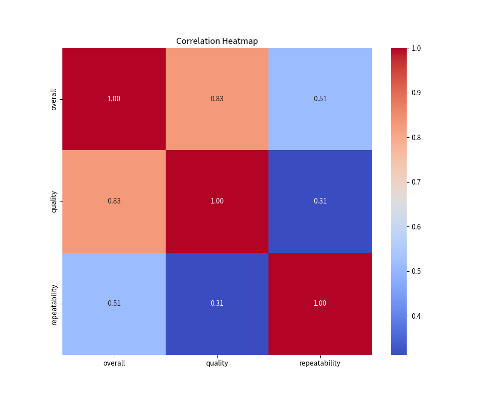
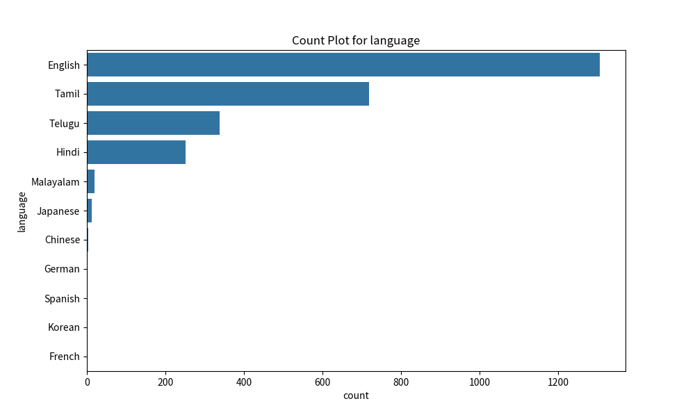

# Automated Analysis

### Summary

Based on the dataset containing 2,652 rows and 8 columns—date, language, type, title, by, overall, quality, and repeatability—let’s delve into a narrative summary and extract key insights from the available data.

### Narrative Summary:

The dataset appears to capture evaluations or reviews over a certain timeframe, as indicated by the presence of a date column. With a significant number of entries, it is structured to include various categorizations such as language, type, and possibly content-related metadata reflected in the columns 'title' and 'by'. 

Among the eight columns, the 'by' field, which likely indicates the author or reviewer, is notably missing values for 262 entries. This could suggest a possible issue with data completeness or consistency, which may affect the analysis of contributor behavior or experience. Notably, all other columns, including key performance indicators like 'overall', 'quality', and 'repeatability', do not exhibit any missing values, indicating a level of robust data collection in those areas.

The presence of 99 missing values in the 'date' column raises questions about the temporal coverage of the data. The 'date' field is crucial for identifying trends over time and understanding patterns in reviews—missing values here may limit temporal analyses.

### Key Insights:

1. **Missing Data Analysis**:
   - The most significant concern lies within the 'by' column, where 262 entries are unfilled. This could skew insights related to authorship, quality assessment, or review trends based on contributor identity.
   - The lack of values in the 'date' column for 99 entries could affect assessments of changes over time and seasonality in review behaviors or trends.

2. **Language Coverage**:
   - The dataset indicates no missing values for language, potentially suggesting a diverse linguistic representation. Language distribution could be analyzed further to assess any correlation between language and review ratings, as different languages might exhibit differing review tendencies.

3. **Types and Trends in Reviews**:
   - Each entry in the 'type' column can be explored to understand the distribution of review types (e.g., product reviews, service reviews, etc.). This analysis could reveal insights into which types garner higher overall or quality ratings.

4. **Quality and Repeatability Assessment**:
   - The quality and repeatability scores are crucial for evaluating consistency in reviews. An analysis can be performed to understand whether higher quality correlates with higher repeatability ratings. This can shed light on the reliability of reviews and their impact on overall ratings.

5. **Overall Ratings Distribution**:
   - Since there are no missing values for the overall ratings, a distribution analysis can be performed—mean, median, and standard deviation calculations can illuminate the general sentiment regarding the items reviewed.

6. **Temporal Trends**:
   - While 99 entries lack dates, the dataset that does contain dates can be examined for trends over time. Assessing review trends based on time could help identify peak periods for reviews or shifts in quality and sentiment.

In summary, the dataset holds a wealth of information but is marred by missing values, particularly in the 'by' and 'date' columns, which restrict certain types of analytical insights. The clean entries available provide a foundation for evaluating overall sentiments, review trends, and quality assessments—which collectively can inform strategic decisions for content or service improvements. Further data cleaning and deeper exploratory analysis would enhance understanding and facilitate more robust conclusions.

