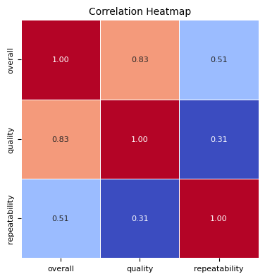
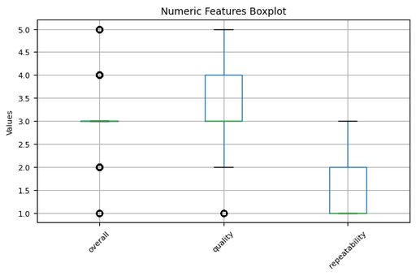

# Automated Data Analysis Report

## Analysis Narrative

### Comprehensive Analysis of the Dataset

#### Dataset Overview
The dataset contains 2,652 rows and 8 columns, addressing various aspects likely related to reviews, ratings, or evaluations, judging by the column names (`overall`, `quality`, `repeatability`, etc.). Below is a summary of the structure and insights extracted from the provided dataset.

#### Summary of Dataset Structure
- **Total Rows**: 2652
- **Total Columns**: 8
- **Missing Values**:
  - `date`: 99 missing entries (3.73%)
  - `by`: 262 missing entries (9.88%)
  - Other columns have no missing values.

- **Unique Values**:
  - `date`: 2055 unique dates
  - `language`: 11 unique languages
  - `type`: 8 types
  - `title`: 2312 unique titles
  - `by`: 1528 unique entries
  - `overall`: 5 unique values (likely ratings)
  - `quality`: 5 unique values (likely classifications or ratings)
  - `repeatability`: 3 unique values (simple categories)

### Outlier Analysis
#### Overall Ratings
- Lower Bound: 3.0  
- Upper Bound: 3.0  
- Outliers Count: 1216  

#### Quality Ratings
- Lower Bound: 1.5  
- Upper Bound: 5.5  
- Outliers Count: 24  

#### Repeatability Ratings
- Lower Bound: -0.5  
- Upper Bound: 3.5  
- Outliers Count: 0  

**Insights**: 
- A significant portion of the `overall` ratings (1216 entries) are outliers, suggesting a concentration around a single rating value (3.0).
- Quality ratings have a few outliers, but they are almost normal, while the repeatability seems to have no outliers at all.

### Statistical Tests
- **Normality Tests**:
  - `overall`: Not normally distributed (p-value ≈ 0)
  - `quality`: Not normally distributed (p-value ≈ 0)
  - `repeatability`: Not normally distributed (p-value ≈ 0)

### Visualization Recommendations
1. **Distribution Plots**:
   - Histograms for `overall`, `quality`, and `repeatability` to visualize the distribution of values and highlight the presence of outliers.
  
2. **Boxplots**:
   - Boxplots for `overall`, `quality`, and `repeatability` to better showcase outliers and the spread of the data.

3. **Correlation Heatmap**:
   - Visualize correlation between the numeric columns (`overall`, `quality`, and `repeatability`).

4. **Trend over Time**:
   - If the `date` column includes relevant timestamps, a time series analysis plotting counts or averages per date would show trends over time.

#### Insights and Recommendations
1. **Data Cleaning**: 
   - Consider handling missing values in the `date` and `by` columns through imputation or removal, depending on the analysis requirement.
   - Investigate outlier causes for `overall` ratings—this could reveal important patterns or issues in data entry or collection.

2. **User Analysis**:
   - The numerous unique values in the `by` column suggest a diverse user base. Segmentation by language and type could provide insights into user preferences and trends.

3. **Further Statistical Testing**: 
   - Conduct further tests like ANOVA or t-test to understand the distinctions between groups (e.g., different languages or types) on rating scores.

4. **Focus on Quality**: 
   - Since `quality` ratings have fewer outliers, they may offer a more reliable measure for evaluating the products or services.

5. **Longitudinal Study**:
   - Use the `date` data to explore ratings over time and see if any interventions or changes in strategy correlate with customer satisfaction.

#### Next Steps
1. Generate the suggested visualizations using libraries such as Matplotlib or Seaborn.
2. Perform additional statistical tests to explore differences among subgroups.
3. Investigate the potential for feature engineering, which could improve the classification or prediction tasks associated with the dataset.

This structured approach will yield deeper insights into your dataset and inform better decision-making going forward.

## Visualizations

### correlation_heatmap_compressed.png

#### Vision-Based Image Analysis

Based on the provided correlation heatmap, here’s a concise analysis of key relationships between the variables:

### 1. Key Relationships Between Variables
- **Overall vs. Quality**: There is a strong positive correlation (0.83), indicating that as overall ratings increase, quality ratings also tend to increase.
- **Overall vs. Repeatability**: A moderate positive correlation (0.51) exists, suggesting that overall ratings and repeatability are somewhat related, albeit less strongly than overall and quality.
- **Quality vs. Repeatability**: A weak positive correlation (0.31) indicates a relatively low relationship, suggesting that improvements in quality do not significantly impact repeatability.

### 2. Strength of Correlations
- **Strong Positive**: The correlation between overall and quality (0.83) is significant and indicates a strong relationship.
- **Moderate Positive**: The relationship between overall and repeatability (0.51) is moderate.
- **Weak Positive**: The correlation between quality and repeatability (0.31) is weak.

### 3. Surprising or Unexpected Correlations
- The relatively weak correlation (0.31) between quality and repeatability is unexpected, as one might anticipate that higher quality would generally lead to more consistent (or repeatable) results. This suggests other factors may influence repeatability outside of the quality measures.

### 4. Potential Insights for Further Investigation
- **Investigate Factors Influencing Repeatability**: Given its

### numeric_boxplot_compressed.png

#### Vision-Based Image Analysis

It seems you've provided a boxplot instead of a correlation heatmap. However, I can guide you on how to perform a similar analysis on the boxplot displayed:

### Key Insights from the Boxplot

1. **Key Relationships Between Variables**:
   - The boxplot illustrates the distribution of three numeric features: **overall**, **quality**, and **repeatability**. 
   - You can observe potential relationships through their median values (the lines within the boxes) and range (the length of the boxes).

2. **Strength of Correlations**:
   - Since this is a boxplot, it does not provide correlation coefficients directly. However, the overlap and proximity of the medians can suggest relative relationships.
   - If one variable consistently shows lower values than others, there may be a negative correlation.

3. **Surprising or Unexpected Findings**:
   - If, for instance, **quality** shows a very tight range compared to the other variables, it might indicate less variability in quality across observations.
   - Any extreme outliers (the dots above or below the whiskers) may indicate cases that do not conform to typical patterns, suggesting potential areas for investigation.

4. **Potential Insights for Further Investigation**:
   - An exploration into the factors influencing the **overall** and **quality** metrics could be beneficial if there is a significant difference between their median values.
   - Investigating the reasons behind any outliers in the **repeatability** variable could uncover anomalies or areas

### date_distribution_compressed.png

#### Vision-Based Image Analysis

It seems you've provided a bar chart rather than a correlation heatmap. However, I can guide you on how to analyze a correlation heatmap if you have one, while noting insights based on the provided bar chart.

### Analysis of Bar Chart

1. **Key Relationships**:
   - The chart displays the count of occurrences for specific dates, suggesting each date corresponds to an event or observation.

2. **Strength of Counts**:
   - The counts for specific dates are relatively equal, ranging from 7 to 8 occurrences, indicating a balanced distribution of events across the dates presented.

3. **Surprising or Unexpected Patterns**:
   - There isn't strong variation among the counts, which could suggest either a consistent occurrence of events or potential sampling bias, depending on the context.

4. **Potential Insights for Further Investigation**:
   - Explore the reasons behind the concentrations of events on certain dates.
   - Investigate what events occurred on each date to understand their significance or recurrence.
   - Consider temporal factors or trends over time that may correlate with the density of events.

For a thorough correlation heatmap analysis, focus on identifying the relationships and strengths among different variables, looking for unexpected correlations that warrant deeper exploration. If you have a heatmap you would like analyzed, please provide it!

